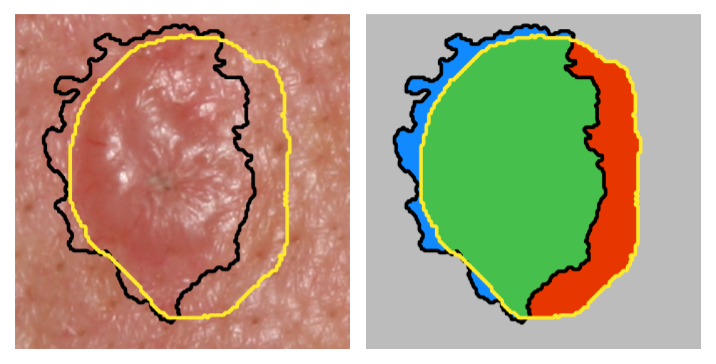

# Matthews Correlation Coefficient Loss for Deep Convolutional Networks: Application to Skin Lesion Segmentation

[](https://github.com/psf/black)

MCC Loss is now available in [smp Segmentation Models PyTorch](https://smp.readthedocs.io/en/stable/losses.html#segmentation_models_pytorch.losses.MCCLoss) as `smp.losses.MCCLoss`.



This is the code corresponding to our ISBI 2021 paper. If you use our code, please cite our paper: 

Kumar Abhishek, Ghassan Hamarneh, "[Matthews Correlation Coefficient Loss for Deep Convolutional Networks: Application to Skin Lesion Segmentation](http://www.cs.sfu.ca/~hamarneh/ecopy/isbi2021.pdf)", The IEEE International Symposium on Biomedical Imaging (ISBI), 2021.

The corresponding BibTeX entry is:

```
@InProceedings{Abhishek_2021_ISBI,
author = {Abhishek, Kumar and Hamarneh, Ghassan},
title = {Matthews Correlation Coefficient Loss for Deep Convolutional Networks: Application to Skin Lesion Segmentation},
booktitle = {The IEEE International Symposium on Biomedical Imaging (ISBI)},,
pages={225--229},
month = {April},
year = {2021}
}
```

## Dependencies
- PyTorch

## Usage

An example usage is shown in `Example.ipynb`, where the Dice and MCC losses are calculated for a simple scenario of 5x5 ground truth and predicted binary masks.