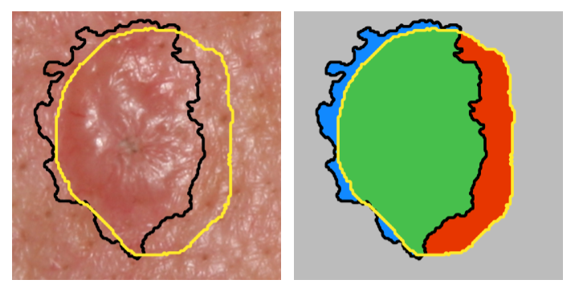

# Matthews Correlation Coefficient Loss for Deep Convolutional Networks: Application to Skin Lesion Segmentation

[](https://github.com/astral-sh/ruff)

MCC Loss is now available in [smp Segmentation Models PyTorch](https://smp.readthedocs.io/en/stable/losses.html#segmentation_models_pytorch.losses.MCCLoss) as `smp.losses.MCCLoss`.



This is the code corresponding to our ISBI 2021 paper. If you use our code, please cite our paper: 

Kumar Abhishek, Ghassan Hamarneh, "[Matthews Correlation Coefficient Loss for Deep Convolutional Networks: Application to Skin Lesion Segmentation](http://www.cs.sfu.ca/~hamarneh/ecopy/isbi2021.pdf)", The IEEE International Symposium on Biomedical Imaging (ISBI), 2021.

The corresponding BibTeX entry is:

```
@InProceedings{Abhishek_2021_ISBI,
author = {Abhishek, Kumar and Hamarneh, Ghassan},
title = {Matthews Correlation Coefficient Loss for Deep Convolutional Networks: Application to Skin Lesion Segmentation},
booktitle = {The IEEE International Symposium on Biomedical Imaging (ISBI)},,
pages={225--229},
month = {April},
year = {2021}
}
```

## Dependencies
- PyTorch

## Usage

```python
from loss import MCCLoss

# Default: probabilities in, batch-wise reduction
criterion = MCCLoss()
y_pred = torch.rand(4, 1, 128, 128)          # predicted probabilities
y_true = torch.randint(0, 2, (4, 1, 128, 128)).float()
loss = criterion(y_pred, y_true)

# With raw logits (before sigmoid)
criterion = MCCLoss(from_logits=True)
loss = criterion(logits, masks)

# Per-sample reduction (compute MCC per sample, then average)
criterion = MCCLoss(reduction="sample")
```

A simple example with 5×5 binary masks is shown in `Example.ipynb`.

## Tests

```bash
python -m pytest test_mcc.py -v
```